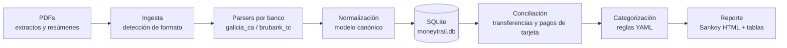

# moneyTrail — Plan de proyecto, arquitectura e implementación

## 1. Objetivo

Mantener un rastro de a dónde va el dinero que entra a las cuentas bancarias.
A partir de los PDFs de extractos de cuenta y resúmenes de tarjeta, reconstruir el
flujo completo del dinero — desde los ingresos (sueldo, reintegros de gastos de la
empresa) hasta las categorías de gasto — y visualizarlo como un **diagrama de
Sankey** por período.

### Qué NO es (por ahora)

- No es una app multi-usuario ni un servicio en la nube: es una herramienta local.
- No se conecta a APIs bancarias: la fuente de verdad son los PDFs que ya recibís.
- No hace presupuestos ni proyecciones (posible fase futura).

## 2. Fuentes de datos analizadas

Se analizaron dos PDFs reales que definen los formatos iniciales a soportar:

### 2.1 Extracto de caja de ahorro — Banco Galicia (ARS)

- Encabezado con datos de cuenta, período (`06/04/2026 → 06/05/2026`) y saldos
  inicial/final (útiles para **validar** que el parseo cerró bien).
- Tabla `Movimientos` con columnas `Fecha | Descripción | Origen | Crédito | Débito | Saldo`.
- La descripción ocupa **varias líneas** (tipo de operación, contraparte, CUIT,
  banco de origen), p. ej.:
  - Ingresos: `TRANSFERENCIAS CASH / SUELDOS / <empleador>` (sueldo),
    `SNP PAGO A PROVEEDORES / <empleador>` (reintegros de gastos).
  - Egresos: `COMPRA DEBITO <nnnn> / <comercio>`, `TRANSF. CTAS PROPIAS`,
    `TRANSFERENCIA A TERCEROS / <nombre>`, `PAGO TARJETA VISA`.
- Fechas en formato `dd/mm/aa`; montos con separador de miles `.` y decimal `,`;
  débitos con signo negativo.

### 2.2 Resumen de tarjeta de crédito — Brubank (ARS + USD)

- Encabezado con ciclo de facturación, balances en pesos y dólares, comisiones,
  impuestos y pagos del período.
- Secciones por tarjeta (`Tarjeta 0461`, `Tarjeta 6504`) con movimientos
  `Fecha | #Ref | Descripción | Dólares | Pesos` — un consumo está en USD **o**
  en ARS, nunca ambos.
- Secciones adicionales: `Comisiones`, `Intereses`, `Impuestos` (IVA, sellos,
  IIBB...), `Cuotas a vencer`, `Pagos` (en ARS y en USD).
- Fechas en formato `yyyy-mm-dd`. Cada movimiento tiene `#Ref` único → ideal
  para deduplicar.

### 2.3 Desafíos de dominio detectados en los datos

1. **Doble conteo**: el `PAGO TARJETA VISA` que sale de la caja de ahorro y los
   consumos individuales del resumen de tarjeta son la *misma plata*. En el Sankey
   el pago de tarjeta debe ser un flujo intermedio (cuenta → tarjeta) que luego se
   abre en los consumos reales, no un gasto en sí.
2. **Transferencias entre cuentas propias**: `TRANSF. CTAS PROPIAS` (Galicia →
   Brubank) no es ni ingreso ni gasto; es un flujo interno que debe quedar
   enlazado entre ambos extremos.
3. **Multi-moneda**: consumos en USD conviven con ARS. Se modelan en su moneda
   original y se convierten sólo al momento de visualizar (tipo de cambio del
   resumen o configurable).
4. **Dos tipos de ingreso** del mismo empleador: sueldo (`SUELDOS`) y reintegros
   (`SNP PAGO A PROVEEDORES`) — el usuario quiere verlos como fuentes separadas.
5. **Formatos heterogéneos**: fechas, signos y layout distintos por banco →
   parsers aislados por institución con un contrato de salida común.

## 3. Arquitectura

Pipeline local de 6 etapas, con SQLite como almacenamiento central:



### 3.1 Etapas

| Etapa | Responsabilidad | Entrada → Salida |
|---|---|---|
| **Ingesta** | Detectar de qué banco/producto es el PDF (por texto de la primera página), calcular hash del archivo, evitar re-importar. | PDF → `(parser, raw_text)` |
| **Parseo** | Un módulo por formato. Extrae período, saldos y movimientos crudos. | texto → `ParsedStatement` |
| **Normalización** | Convertir al modelo canónico: fechas ISO, montos `Decimal` con signo, moneda explícita, hash de deduplicación por movimiento. | `ParsedStatement` → `Transaction[]` |
| **Conciliación** | Emparejar transferencias entre cuentas propias y pagos de tarjeta (por monto, fecha ±3 días y cuentas involucradas). Marca pares como `internal`. | `Transaction[]` → links |
| **Categorización** | Reglas declarativas (regex sobre descripción/contraparte → categoría). Lo no matcheado queda `Sin categorizar` y se lista para agregar reglas. | `Transaction` → `category` |
| **Reporte** | Agregar flujos por período y generar HTML estático con Sankey (Plotly) + tabla de movimientos + no-categorizados. | DB → `report.html` |

### 3.2 Modelo de datos (SQLite)

```
account        id, bank, product ('caja_ahorro'|'tarjeta_credito'), currency, label
statement      id, account_id, file_hash (UNIQUE), period_start, period_end,
               opening_balance, closing_balance, imported_at
transaction    id, statement_id, account_id, date, description_raw,
               counterparty, amount (Decimal, +crédito/−débito), currency,
               dedupe_hash (UNIQUE), category_id, kind
               -- kind: income | expense | transfer_internal | card_payment |
               --       tax | fee | interest
transfer_link  id, tx_out_id, tx_in_id, confidence
category       id, parent_id, name          -- taxonomía de 2 niveles
rule           orden, pattern (regex), field, category, kind_override  -- en YAML
```

**Deduplicación**: `dedupe_hash = sha256(account, date, amount, currency, descripción_normalizada, #ref si existe)`. Re-importar un PDF (o dos períodos que se solapan, como los extractos "consolidados") es un no-op.

**Validación de parseo**: `opening_balance + Σ(movimientos) == closing_balance`.
Si no cierra, el import falla con detalle — es la mejor defensa contra parsers rotos.

### 3.3 Semántica del Sankey

Nodos en 3 (o 4) columnas:

```
[Fuentes de ingreso]      [Cuentas]              [Categorías]         [Subcategorías]
 Sueldo ───────────────►  Galicia CA ──────────► Supermercado
 Reintegros ───────────►     │    │
                             │    └─ (interno) ► Brubank ──► Tarjeta ► Delivery
                             │                                        ► Suscripciones
                             └───────────────────► Transferencias a terceros
                                                 ► Ahorro (saldo no gastado)
```

Reglas de agregación:
- Los movimientos `transfer_internal` se dibujan como flujo entre cuentas, nunca
  como gasto.
- El `card_payment` se reemplaza por los consumos del resumen de tarjeta
  correspondiente (si el resumen fue importado; si no, queda como "Tarjeta (sin detalle)").
- El excedente `ingresos − egresos` del período se muestra como flujo a "Ahorro".
- USD se convierte a ARS para el Sankey (tipo de cambio configurable por período)
  pero se conserva el detalle original en tablas.

### 3.4 Categorización por reglas

`rules/categories.yaml`, evaluadas en orden, primera que matchea gana:

```yaml
- match: "RAPPI|PEDIDOSYA"          # sobre descripción + contraparte, case-insensitive
  category: Comida/Delivery
- match: "UBER|CABIFY"
  category: Transporte/Apps
- match: "DISNEY|NETFLIX|SPOTIFY|AUDIBLE|ANTHROPIC"
  category: Suscripciones
- match: "SUELDOS"
  category: Ingresos/Sueldo
  kind: income
- match: "SNP PAGO A PROVEEDORES"
  category: Ingresos/Reintegros
  kind: income
- match: "TRANSF\\. CTAS PROPIAS"
  kind: transfer_internal
- match: "PAGO TARJETA"
  kind: card_payment
- match: "IVA|IMPUESTO|ING\\. BRUTOS|SELLOS"
  category: Impuestos y comisiones
```

Fase futura opcional: sugerir categoría vía LLM para lo no matcheado, siempre con
confirmación manual que se persiste como regla nueva.

### 3.5 Stack tecnológico

| Componente | Elección | Por qué |
|---|---|---|
| Lenguaje | Python 3.11+ | Ecosistema PDF/datos maduro; scripts locales simples |
| Extracción PDF | `pdfplumber` | Ya validado contra los dos PDFs reales; da texto + posiciones para tablas |
| Modelo/validación | `pydantic` v2 | Contratos claros entre etapas del pipeline |
| Storage | SQLite (stdlib `sqlite3`) | Un archivo, cero servidor, queries SQL para reportes |
| CLI | `typer` | Subcomandos con poco boilerplate |
| Visualización | Plotly (Sankey) → HTML estático | Interactivo (hover con montos), sin servidor; se abre en el navegador |
| Montos | `Decimal` siempre | Nunca floats para plata |
| Tests | `pytest` + PDFs de fixture anonimizados | Golden tests por parser |

Alternativas descartadas: web app (overkill para uso personal, complica la
privacidad), pandas como storage (sin persistencia incremental), OCR (los PDFs
son nativos, tienen capa de texto).

### 3.6 Estructura del repositorio

```
moneyTrail/
├── pyproject.toml
├── README.md
├── PLAN.md
├── rules/
│   └── categories.yaml          # reglas de categorización (versionadas)
├── data/                        # ← .gitignore: PDFs y DB, nunca se commitean
│   ├── inbox/                   # PDFs nuevos a importar
│   ├── archive/                 # PDFs ya procesados
│   └── moneytrail.db
├── src/moneytrail/
│   ├── cli.py                   # typer: import / reconcile / report / status
│   ├── models.py                # Transaction, Statement, Account (pydantic)
│   ├── db.py                    # schema + acceso SQLite
│   ├── ingest.py                # detección de formato, hashing, orquestación
│   ├── parsers/
│   │   ├── base.py              # interfaz StatementParser + registro
│   │   ├── galicia_caja_ahorro.py
│   │   └── brubank_tarjeta.py
│   ├── reconcile.py             # matching de transferencias y pagos de tarjeta
│   ├── categorize.py            # motor de reglas
│   └── report/
│       ├── sankey.py            # armado de nodos/links del Sankey
│       └── html.py              # template del reporte
└── tests/
    ├── fixtures/                # PDFs sintéticos/anonimizados por formato
    ├── test_parser_galicia.py
    ├── test_parser_brubank.py
    ├── test_reconcile.py
    └── test_categorize.py
```

### 3.7 CLI (experiencia de uso)

```bash
moneytrail import data/inbox/           # detecta formato, parsea, valida, guarda, archiva
moneytrail status                       # cuentas, períodos cubiertos, huecos, sin categorizar
moneytrail categorize --review          # lista no categorizados, sugiere agregar reglas
moneytrail report --from 2026-04 --to 2026-06 --open   # genera y abre report.html
```

### 3.8 Privacidad

- Todo corre local; ningún dato sale de la máquina.
- `data/` (PDFs y DB) está en `.gitignore` desde el primer commit.
- Los fixtures de test se generan sintéticos o anonimizados (sin CUIL, CBU,
  números de cuenta/tarjeta reales).

## 4. Plan de implementación

Cada fase termina con algo usable y testeado. Estimaciones en sesiones de trabajo (~2-4 h).

### Fase 0 — Scaffolding (0.5 sesión)
- [x] `pyproject.toml` (deps: pdfplumber, pydantic, typer, plotly, pytest), `src/` layout, `.gitignore` con `data/`.
- [x] `models.py` + `db.py` con schema y migración inicial.
- [x] CLI esqueleto con `import` / `status` vacíos.

### Fase 1 — Parsers (2 sesiones) ← el corazón del proyecto
- [x] Interfaz `StatementParser` (`detect(text) -> bool`, `parse(pdf) -> ParsedStatement`) + registro de parsers.
- [x] Parser **Galicia caja de ahorro**: encabezado (período, saldos), movimientos con descripción multi-línea, montos AR.
- [x] Parser **Brubank tarjeta**: secciones por tarjeta, consumos ARS/USD, comisiones, impuestos, pagos.
- [x] Validación saldo inicial + Σ movimientos = saldo final (Galicia) y subtotales por tarjeta (Brubank).
- [x] Golden tests con fixtures anonimizados de ambos formatos.
- **Criterio de salida**: `moneytrail import` deja los dos PDFs reales en la DB sin errores de validación.

### Fase 2 — Deduplicación e idempotencia (0.5 sesión)
- [x] `dedupe_hash` por movimiento; re-import del mismo PDF = 0 filas nuevas.
- [x] Solapamiento de períodos (extractos consolidados) manejado por el mismo hash.
- [x] `moneytrail status` con períodos cubiertos y detección de huecos por cuenta.

### Fase 3 — Conciliación (1 sesión)
- [x] Matching `TRANSF. CTAS PROPIAS` ↔ acreditación en la otra cuenta (monto exacto, fecha ±3 días).
- [x] Matching `PAGO TARJETA` ↔ sección `Pagos` del resumen de tarjeta del período.
- [x] Tabla `transfer_link` con confianza; los no matcheados quedan visibles en `status`.
- [x] Tests de los dos casos con montos reales de los fixtures.

### Fase 4 — Categorización (1 sesión)
- [x] Motor de reglas YAML (regex ordenadas, primera gana, `kind_override`).
- [x] Set inicial de reglas basado en los comercios reales vistos (Rappi, Uber, Disney+, Audible, suscripciones, impuestos, sueldo, reintegros).
- [x] `moneytrail categorize --review`: lista no categorizados agrupados por descripción con frecuencia y monto acumulado.
- **Criterio de salida**: ≥90 % del monto de los PDFs de ejemplo categorizado.

### Fase 5 — Reporte Sankey (1.5 sesiones)
- [x] Agregación de flujos: fuentes → cuentas → categorías (con reemplazo de pagos de tarjeta por sus consumos y flujo "Ahorro" para el excedente).
- [x] Conversión USD→ARS configurable por período.
- [x] `report.html`: Sankey Plotly + tabla top gastos + no categorizados + totales del período.
- [x] Filtros `--from/--to` por mes.
- **Criterio de salida**: el diagrama responde "¿a dónde se fue la plata este mes?" de un vistazo.

### Fase 6 — App de escritorio (completada)
- [x] Lanzadores de doble click por sistema operativo; cero terminal.
- [x] UI local (Flask + HTML estático, sin build step) con drag & drop de PDFs.
- [x] Sankey interactivo con drill-through: cada nodo abre las transacciones que lo componen.
- [x] Categorización de un click, con sugerencia, aprendizaje persistente y deshacer.

### Fase 7 — Profundidad de datos y ritual mensual (completada)
- [x] Más parsers: Brubank cuenta (multi-subcuenta ARS/USD) y American Express.
- [x] Evolución mensual: ingresos vs gastos, resultado por mes, categorías apiladas en el tiempo.
- [x] Comparación contra el mes anterior por categoría (qué subió y qué bajó).
- [x] Comercios agrupados ignorando números de referencia; ranking y totales.
- [x] Detección de gastos recurrentes, separando cargos fijos (y sus aumentos) de hábitos.
- [x] Buscador de movimientos con filtros y export CSV.
- [x] Panel "Tu próximo paso": detecta resúmenes faltantes por cuenta y guía el ritual mensual.
- [x] Cobertura por mes: los meses a los que les falta un extracto se marcan y se excluyen de promedios.
- [x] Persistencia de preferencias (período y tipo de cambio) entre sesiones.

#### Decisiones de performance (Fase 7)

El objetivo explícito era que **tocar los inputs no trabe el proceso**. Tres medidas:

1. **Un solo round-trip por acción.** `/api/state` devuelve estado, Sankey e
   insights juntos; importar, guardar una regla o deshacerla ya devuelven el
   estado nuevo. La UI nunca encadena tres requests para reflejar un click.
2. **Caché invalidado por versión de datos.** `db.data_version()` sube sólo al
   escribir; las lecturas caras (Sankey, insights) se cachean contra ese número.
   Navegar meses o abrir el detalle de un nodo no recalcula nada.
3. **UI optimista.** Al categorizar, la fila se va al instante y el contador
   baja; el servidor confirma después. Medido en el flujo real: **~45 ms** por
   click contra los ~1,5 s previos.

Los tests de `test_cache.py` fijan estas garantías para que no se pierdan.

### Fase 8 — Backlog
- [ ] Más parsers (otros bancos/tarjetas que uses).
- [ ] Sugerencia de categorías con LLM local/API con confirmación manual.
- [ ] Presupuestos por categoría con alertas al superarlos.
- [ ] Proyección de fin de mes según el ritmo de gasto.

## 5. Riesgos y mitigaciones

| Riesgo | Impacto | Mitigación |
|---|---|---|
| Los bancos cambian el layout del PDF | Parser roto silencioso | Validación de saldos obligatoria en cada import; golden tests |
| Extractos con períodos solapados | Movimientos duplicados | `dedupe_hash` único por movimiento |
| Falsos positivos en conciliación (dos transferencias del mismo monto) | Flujos internos mal enlazados | Ventana de fecha acotada + desempate por cercanía + revisión en `status` |
| Regex de categorías demasiado amplias | Gastos mal clasificados | Reglas ordenadas de específico a genérico + reporte de auditoría por categoría |
| PDFs escaneados sin capa de texto | Parser no aplica | Fuera de alcance v1; error claro sugiriendo OCR |

## 6. Decisión de arranque

Empezar por la **Fase 1 con los dos formatos reales** (Galicia caja de ahorro y
Brubank tarjeta): son los datos que ya tenés, cubren los dos casos estructurales
(cuenta bancaria y tarjeta de crédito) y fuerzan a resolver desde el día uno los
problemas difíciles (multi-línea, multi-moneda, conciliación).
